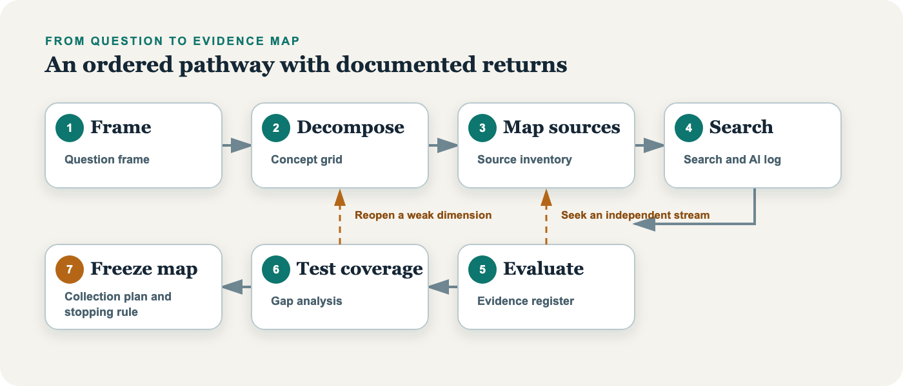

## The Collection Problem

A folder can contain ten thousand documents and still fail to constitute a corpus. Quantity does not establish relevance. Storage does not create an argument. Search results do not explain what was missed.

An evidence map addresses this problem by placing the research question at the center of collection. Around it sit the concepts that require clarification, the actors and institutions that may have produced records, the periods and places that bound the inquiry, and the source families capable of answering different parts of the question. As collection proceeds, the map records where evidence accumulates and where it does not.

The term echoes the evidence gap map of systematic-review practice, a matrix of interventions against outcomes that shows where published findings are dense or thin. The evidence map here serves a different task. It charts not published findings but the sources that could bear on a single question, and it grows as the collection grows.

The map borrows the discipline of reproducible search reporting without treating every qualitative project as a systematic review.^[For current reporting standards on information sources, search strategies, and record management, see @rethlefsen2021prismas and @page2021prisma.] A historian cannot always specify the archive's contents in advance. An ethnographer may revise the question after entering the field. A researcher working under authoritarian rule may withhold operational detail to protect participants. Transparency must answer to method and ethics.

The purpose is not mechanical replication. The purpose is reasoned reconstruction. The record is intended to let another scholar reconstruct how the inquiry moved, why some materials entered the corpus, why others did not, and where uncertainty remains.

## The Seven Stages

The evidence map develops through seven stages. The first frames the question. The second decomposes it into concepts and contexts. The third identifies source families. The fourth conducts and records iterative searches. The fifth evaluates individual records and collections. The sixth tests coverage. The seventh turns the accumulated artifacts into a collection plan and stopping rule.

The sequence is ordered, but research rarely follows it once. A new archive may reveal an actor missing from the original question. A contradictory interview may expose a concept that was defined too narrowly. A failed search may show that a source family never existed. Each discovery sends the researcher backward. Revision is not evidence that the method failed. Revision is the method working.

The map therefore preserves versions. The question recorded on the first day does not disappear when the question changes. The source inventory does not overwrite a mistaken expectation. A rejected AI suggestion remains in the audit log with the reason for rejection. These records show how the project learned.

::: {.content-visible when-profile="site"}
```{=html}
<div class="visual-companion" role="region" data-evidence-map-pilot aria-labelledby="visual-companion-title">
  <header class="visual-companion-header">
    <div>
      <p class="visual-kicker">Interactive visual companion</p>
      <h3 id="visual-companion-title">Follow the method. Inspect the map.</h3>
      <p>Select a stage to see its decision, artifact, and appropriate AI role. Then explore how the running example connects concepts, source families, and reviewable research records.</p>
    </div>
    <p class="visual-companion-note"><strong>Web enrichment</strong><br>This companion adds exploration to the stable method described in the text. It does not replace the worksheets or the frozen evidence map.</p>
  </header>

  <div class="stage-lab" aria-labelledby="stage-lab-title">
    <div class="visual-section-heading">
      <div>
        <p class="visual-kicker">Seven-stage pathway</p>
        <h4 id="stage-lab-title">From question to stopping rule</h4>
      </div>
      <p>Research moves forward, but discoveries can send the inquiry back to an earlier decision.</p>
    </div>

    <div class="stage-rail" role="tablist" aria-label="Evidence-map stages">
      <button id="stage-tab-frame" class="stage-tab is-active" type="button" role="tab" aria-selected="true" aria-controls="stage-detail" data-stage="frame"><span>01</span>Frame</button>
      <button id="stage-tab-decompose" class="stage-tab" type="button" role="tab" aria-selected="false" aria-controls="stage-detail" data-stage="decompose" tabindex="-1"><span>02</span>Decompose</button>
      <button id="stage-tab-sources" class="stage-tab" type="button" role="tab" aria-selected="false" aria-controls="stage-detail" data-stage="sources" tabindex="-1"><span>03</span>Map sources</button>
      <button id="stage-tab-search" class="stage-tab" type="button" role="tab" aria-selected="false" aria-controls="stage-detail" data-stage="search" tabindex="-1"><span>04</span>Search</button>
      <button id="stage-tab-evaluate" class="stage-tab" type="button" role="tab" aria-selected="false" aria-controls="stage-detail" data-stage="evaluate" tabindex="-1"><span>05</span>Evaluate</button>
      <button id="stage-tab-coverage" class="stage-tab" type="button" role="tab" aria-selected="false" aria-controls="stage-detail" data-stage="coverage" tabindex="-1"><span>06</span>Test coverage</button>
      <button id="stage-tab-freeze" class="stage-tab" type="button" role="tab" aria-selected="false" aria-controls="stage-detail" data-stage="freeze" tabindex="-1"><span>07</span>Freeze map</button>
    </div>

    <article id="stage-detail" class="stage-detail" role="tabpanel" aria-live="polite" aria-labelledby="stage-tab-frame" tabindex="0">
      <div class="stage-detail-number" aria-hidden="true">01</div>
      <div class="stage-detail-copy">
        <p class="stage-detail-label">Frame the question</p>
        <h5>Decide what the inquiry is trying to explain.</h5>
        <p class="stage-detail-summary">State the purpose, unit of analysis, provisional boundaries, and what the project will not attempt to answer.</p>
      </div>
      <dl class="stage-detail-grid">
        <div><dt>Decision</dt><dd data-stage-field="decision">Which question is specific enough to guide collection without foreclosing discovery?</dd></div>
        <div><dt>Artifact</dt><dd data-stage-field="artifact">Question-framing worksheet</dd></div>
        <div><dt>AI role</dt><dd data-stage-field="ai">Challenge boundaries after the researcher has stated the purpose.</dd></div>
      </dl>
      <a class="stage-detail-link" data-stage-link href="03-frame.html">Open the stage chapter <span aria-hidden="true">→</span></a>
    </article>
  </div>

  <div class="map-lab" aria-labelledby="map-lab-title">
    <div class="visual-section-heading">
      <div>
        <p class="visual-kicker">Worked example</p>
        <h4 id="map-lab-title">Why do accounts of terrorism patterns diverge?</h4>
      </div>
      <p>Filter the map by layer or inspect a node. Lines indicate a research dependency, not proof of a causal relationship.</p>
    </div>

    <div class="map-toolbar" role="group" aria-label="Filter evidence-map nodes">
      <button class="map-filter is-active" type="button" data-map-filter="all" aria-pressed="true">All layers</button>
      <button class="map-filter" type="button" data-map-filter="concept" aria-pressed="false">Concepts</button>
      <button class="map-filter" type="button" data-map-filter="source" aria-pressed="false">Source families</button>
      <button class="map-filter" type="button" data-map-filter="artifact" aria-pressed="false">Artifacts</button>
      <button class="map-filter" type="button" data-map-filter="gap" aria-pressed="false">Weak or missing</button>
    </div>

    <div class="evidence-map-canvas">
      <svg class="evidence-map-edges" aria-hidden="true"></svg>

      <button class="map-node map-node-question" type="button" data-map-node="question" data-layer="question" data-status="anchor">
        <span>Research question</span>
        Why do accounts of terrorism patterns diverge?
      </button>

      <button class="map-node" type="button" data-map-node="definition" data-connects="question" data-layer="concept" data-status="mixed">
        <span>Concept</span>
        Definition
      </button>
      <button class="map-node" type="button" data-map-node="coverage" data-connects="question" data-layer="concept" data-status="gap">
        <span>Concept</span>
        Coverage
      </button>
      <button class="map-node" type="button" data-map-node="institutions" data-connects="question" data-layer="concept" data-status="strong">
        <span>Context</span>
        Institutional purpose
      </button>

      <button class="map-node" type="button" data-map-node="official" data-connects="definition coverage institutions" data-layer="source" data-status="mixed">
        <span>Source family</span>
        Official records
      </button>
      <button class="map-node" type="button" data-map-node="independent" data-connects="definition coverage institutions" data-layer="source" data-status="strong">
        <span>Source family</span>
        Independent databases
      </button>
      <button class="map-node" type="button" data-map-node="news" data-connects="definition coverage institutions" data-layer="source" data-status="mixed">
        <span>Source family</span>
        News sources
      </button>
      <button class="map-node" type="button" data-map-node="scholarship" data-connects="definition coverage institutions" data-layer="source" data-status="mixed">
        <span>Source family</span>
        Scholarly research
      </button>

      <button class="map-node" type="button" data-map-node="register" data-connects="official independent news scholarship" data-layer="artifact" data-status="strong">
        <span>Research record</span>
        Evidence register
      </button>
      <button class="map-node" type="button" data-map-node="gaps" data-connects="register" data-layer="artifact" data-status="gap">
        <span>Research record</span>
        Gap analysis
      </button>
      <button class="map-node" type="button" data-map-node="stopping" data-connects="register gaps" data-layer="artifact" data-status="gap">
        <span>Research record</span>
        Stopping rule
      </button>
    </div>

    <div class="map-inspector" role="status" aria-live="polite">
      <div>
        <p class="map-inspector-label">Selected node</p>
        <h5 data-map-detail-title>Research question</h5>
      </div>
      <p data-map-detail-copy>The question organizes collection without presuming that one source family contains the complete or correct account.</p>
      <p class="map-inspector-status"><span data-map-detail-status>Anchor</span></p>
    </div>

    <noscript><p class="visual-noscript">The interactive filters require JavaScript. All nodes remain visible, and the chapter text provides the complete method.</p></noscript>
  </div>
</div>
```
:::

::: {.content-visible when-profile="manuscript"}
### Seven-stage pathway

{#fig-evidence-map-pathway fig-cap="The evidence map develops through seven ordered but revisable stages."}
:::

## The Worked Example

Our running question asks why accounts of terrorism patterns diverge across official records, independent databases, news sources, and scholarly research. The question does not presume that one source class is correct and the others are mistaken. It asks how distinct systems produce different pictures of violence.

The problem begins with definition. A database must decide what counts as terrorism. It must translate that decision into inclusion criteria. It must then apply those criteria to sources created for other purposes. A news report seeks to describe an event under deadline. A police record serves an administrative or legal process. A scholarly database standardizes information across cases. Each source sees something. None sees everything.

Collection practices add another layer. The official documentation for the Global Terrorism Database describes a system built across several historical collection efforts and a codebook designed to let users apply different definitional thresholds.^[See @start2024codebook.] Research using that system has also shown why domestic and transnational events may require analytical separation and why changes in coding or source coverage matter.^[See @enders2011domestic.] The point here is not to settle disputes about terrorism counts. It is to reveal the chain of decisions between event and claim.

This is the pattern. Evidence reaches the researcher through institutions.

## What the Map Contains

The map exists in two states. A working map grows and changes from the first stage, as searches run and records accumulate. A frozen map, dated and set aside at the seventh stage, marks the end of a collection phase. The frozen map contains six connected records, and the seventh stage assembles them rather than adding a record of its own. The question frame defines the inquiry and its provisional boundaries. The concept-and-context grid translates the question into searchable dimensions. The source-family inventory identifies who could have recorded each dimension and where those records might reside. The search log records routes, terms, dates, results, and revisions. The evidence register assesses each record's relevance, provenance, and limits. The gap analysis shows empty, weak, or contradictory parts of the map.

Two of these records form a matrix. The concept-and-context grid supplies the rows, the question's dimensions. The source-family inventory supplies the columns. Each cell asks whether a dimension has been recorded by a given family, and with what quality. Coverage testing and gap analysis read these cells: which are filled, which are empty, and which rest on a single dependent source.

The stopping rule sits across all six. It states what conditions justify ending active collection for the present phase. It identifies what remains missing, why the missing material matters, and what would cause the search to reopen.

A stopping rule is not a declaration that nothing else exists. It is an argument that the present corpus can support the next analytical task.

## The Role of AI

AI can assist at four points in this module. It can propose dimensions after the researcher frames the question. It can expand search vocabulary and candidate source families. It can challenge a search plan by adopting neglected perspectives. It can inspect a filled map for weak cells and repeated dependence on one source stream.

These uses share one condition: the system proposes, and the researcher disposes. A plausible archive name must be verified. A suggested source family must be examined for ethical and practical access. A proposed gap must be tested against the question rather than accepted because the model stated it fluently.

The guide records every accepted suggestion and every consequential rejection. This is not a clerical burden. It is evidence of judgment.

::: {.content-visible when-profile="site"}
## Reader Resources

The pilot includes five editable resources. They are separate from the prose so that researchers can use them without adopting a particular software system.

::: {.resource-grid}
::: {.resource-card}
### Frame the question

[Download the Word worksheet](../templates/question-framing.docx)
:::

::: {.resource-card}
### Decompose concepts

[Download the concept grid](../templates/concept-context-grid.xlsx)
:::

::: {.resource-card}
### Map source families

[Download the source inventory](../templates/source-family-inventory.xlsx)
:::

::: {.resource-card}
### Record searches and AI

[Download the audit log](../templates/search-ai-audit-log.xlsx)
:::

::: {.resource-card}
### Assemble the final map

[Download the evidence-map workbook](../templates/evidence-map-stopping-rule.xlsx)
:::
:::
:::
