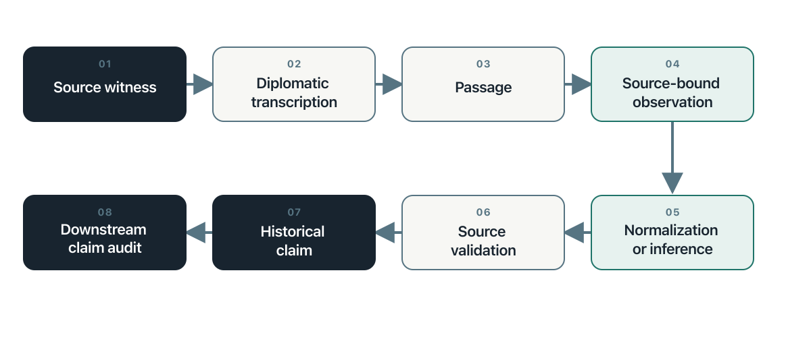

## Orientation

An archival page rarely arrives as a fact. It arrives as a material witness: a page, image, recording, catalogue record, or later copy produced for a purpose and preserved through a sequence of decisions. A researcher must identify the document, read its marks, recover its language, determine who made each statement, place the statement in time, compare it with other traces, and decide what claim the surviving evidence can bear. Each move changes the object.

AI can shorten transcription, retrieval, comparison, and preliminary extraction. It can also conceal the moves between them. A fluent response may modernize a name without saying so, turn a warrant into an arrest, join two people because they share a surname, or treat an allegation as an event. The central method of this chapter is therefore simple: keep the source witness, transcription, source-bound observation, normalization, inference, historical claim, and audit decision distinct and linked. A historically correct statement remains procedurally unsupported when the supplied evidence does not support it.

This method adds the historian's discipline to the book's existing chain. The evidence map identifies source families. The event-database chapter converts verified records into resolved events and variables. Historical research requires closer control over the transformations that precede a verified record and the interpretations that follow it. The chapter supplies that control.

The design adapts the companion *Historical Evidence Chain* pilot, which uses legal records associated with the Salem witch trials to test transcription, extraction, and claim audit.[@pedahzur2026historical] The pilot is a research design, not a completed experiment. It contains no empirical findings, and this chapter makes none on its behalf. Its contribution here is a portable method that applies beyond Salem and beyond handwritten documents.

## Learn

### Historical judgment is a sequence of controlled distinctions

Historical expertise does not consist of remembering more dates than a machine. It lies in the questions brought to a source and the restraint applied to the answer. Studies of historical reasoning show that experienced historians attend to authorship, purpose, context, and relations among documents while evaluating what a source can support.[@wineburg1991historical] The same habits matter when a model performs the first reading.

| Historical capability | Governing question | Common AI-assisted failure |
|---|---|---|
| Source criticism | Who produced this record, for whom, and under what conditions? | Treating text as detached information |
| Contextualization | What did these words, offices, procedures, and categories mean at that time? | Importing present categories into past settings |
| Temporal reasoning | What happened, was ordered, was reported, or was remembered, and in what sequence? | Collapsing intention, action, and retrospective account |
| Attribution | Whose assertion does the passage preserve? | Recasting an allegation or quotation as fact |
| Corroboration | Do several traces offer independent support? | Counting copies or dependent accounts as confirmation |
| Reading silence | What could enter this archive, what survived, and whose experience remained unrecorded? | Treating missing search results as historical absence |
| Claim calibration | What is the strongest claim this evidence can sustain? | Moving from plausible interpretation to asserted conclusion |

These are connected judgments. Provenance without context can identify a creator yet miss the institution that shaped the record. Corroboration without source dependence can count one account several times. A precise transcription without attribution can reproduce words while misrepresenting their status.

### Preserve the historical evidence chain

The chain contains objects, not stages hidden inside one prompt. Each object retains a stable identity and points backward to the material on which it depends.

{#fig-historical-evidence-chain fig-alt="Eight numbered boxes connect a source witness to diplomatic transcription, passage, source-bound observation, normalization or inference, source validation, historical claim, and downstream claim audit." fig-cap="The historical evidence chain keeps every transformation and audit decision linked to its source."}

The source witness is the physical or digital object supplied for analysis. A diplomatic transcription preserves spelling, line order, deletions, insertions, gaps, and uncertain readings as far as the research purpose requires. A passage is an addressable span within a fixed transcription. A source-bound observation records a person, role, date, place, action, relation, or statement anchored to that passage. Normalization and inference remain declared transformations. Source validation checks an observation against its passage. A historical claim combines observations through analysis. The downstream audit follows the claim's dependencies back through observations and passages to source witnesses.

This chain extends ordinary data provenance. Provenance records entities, activities, and responsible agents.[@lebo2013provo] Historical work also asks why a record existed, what institutional procedure produced it, what failed to survive, and how later categories alter the source's meaning. The technical lineage is necessary. It is not sufficient.

### Keep three epistemic layers separate

Every consequential field belongs to one of three layers. **Source-stated** content appears in the document. **Normalized** content transforms a source expression through a declared rule or authority. **Inferred** content adds a conclusion that the document does not state. The database may connect the layers, but one must never overwrite another.

Suppose a page gives a date through an obsolete calendar, spells a person's name in two ways, and describes an office that has no exact modern equivalent. The transcription preserves the forms on the page. A normalized field records the standardized date and name, together with the rule used. An interpretive memo explains the office in its institutional setting. None of these changes the source text.

This separation makes disagreement useful. Two researchers may agree on the letters but disagree on the normalized identity. They may agree on identity but disagree on the institutional meaning. A single corrected field would hide where the disagreement occurred.

### Validate observations and audit claims separately

A source-bound observation and a historical claim require different tests. The first asks whether a defined passage supports a local record. The second asks whether a larger proposition follows from several records, their relations, and the stated reasoning.

A prior validation does not automatically validate a later claim. A warrant may support the observation that an authority ordered an arrest. It does not support the claim that officers executed the order. A summons may identify an intended witness. It does not establish that the person testified. An indictment records a procedural act. It does not establish guilt or conviction.

The downstream audit classifies each claim as supported, partially supported, unsupported, contradicted, or not assessable. It also records missing links, dependent evidence, disputed interpretations, and the smallest revision the evidence could support. The audit does not silently repair the claim. It preserves the submitted proposition and creates a separate decision.

### Treat roles and identities as historical relations

A role belongs to a person in a document or event, not to the person for all time. The same individual may appear as a deponent in one record, an accused person in another, and a named third party in a later account. A model that assigns one permanent role can distort sequence and agency.

Identity resolution requires the same caution. Shared names, titles, residences, or kinship terms create candidates for comparison. They do not settle identity. Preserve each mention as written, record the proposed link and its basis, and leave unresolved cases unresolved. This protects the chronology from a confident but mistaken merge.

### Read absence through the history of the archive

Archives do not preserve a neutral sample of the past. Institutions decide what to record. Power shapes whose speech enters a file and in what form. Survival, cataloguing, digitization, OCR, language, licensing, and search interfaces then shape what a researcher can find. Historical silences can enter at each of these moments.[@trouillot1995silencing] Digitized newspaper collections demonstrate how selection and technical quality alter the apparent record before a query begins.[@beelen2023bias]

A failed search therefore creates a diagnostic question, not a finding of absence. The term may be wrong for the period. The handwriting model may have failed. The relevant volume may remain undigitized. The institution may never have recorded the experience. The record may have been destroyed, closed, or catalogued through the vocabulary of an authority rather than the people under study.

AI can compare catalogues, generate historical terms, and find recurrent gaps. It cannot decide which absence is meaningful without a source history. The search log should record the live alternatives.

### Assign AI the transformations that can be tested

Handwritten-text recognition and related systems can make large manuscript collections searchable and reduce the labor of first-pass transcription.[@muehlberger2019transkribus] Language models can also propose layouts, uncertain readings, entities, dates, relationships, and claim dependencies. These operations become defensible when their outputs can be compared with defined source regions and reviewed under a fixed protocol.

Historical judgment remains with the researcher. The model does not determine authenticity, representativeness, periodization, independence, or causal importance. It does not decide whether an old term maps onto a modern category. It does not infer that a record's survival measures an event's prevalence. Automation can increase the number of documents examined. It cannot enlarge the claim beyond the evidence.

## Worked Example

The Salem companion pilot supplies a demanding design case because legal records preserve different procedural acts and attributed statements. Complaints, warrants, examinations, depositions, indictments, returns, and court records do different evidentiary work. A model that treats them as interchangeable can produce a smooth chronology that the documents do not support.

Consider a hypothetical sequence designed to illustrate the method. A complaint records that one person accused another. A warrant orders an officer to apprehend the accused person. A return later records that the officer executed the warrant. A jail record records custody. The four documents may refer to one process, but each supports a different proposition.

| Record | Source-bound observation | Claim the record does not establish by itself |
|---|---|---|
| Complaint | A named person made an attributed allegation | The alleged act occurred |
| Warrant | An authority ordered apprehension | The apprehension occurred |
| Return | An officer reported executing the order | Every later detail of custody |
| Jail record | The institution recorded custody at a stated time | The accusation was true |

The transcription pass preserves each page and uncertain reading. The extraction pass binds each proposition to an exact passage, keeps dates and names as written, and records any normalization separately. The validation pass tests each source-bound observation. Only then does analysis connect the documents into a process. A historical claim about arrest or detention declares which records support it and which inferential step joins them.

This example also exposes dependence. A later narrative may repeat the complaint without adding an independent source. Several database rows may therefore represent several documents but one originating assertion. The evidence chain preserves both the later circulation and the shared origin.

The pilot will compare independent human coding with model runs, but no results exist yet. Its present value lies in the experiment it makes possible: transcription accuracy, evidence-span completeness, unsupported inference, uncertainty calibration, and types of human-model disagreement can be evaluated separately. A single overall accuracy score would hide the mechanism of failure.

## Try It

Select one rights-cleared historical document and define the research purpose before processing it. Record the source witness, holding institution, collection, locator, access conditions, image sequence, document boundary, and reason for selection. Then prepare a diplomatic transcription that marks uncertain readings rather than repairing them from outside knowledge.

Create three source-bound observations. For each one, preserve an exact passage, source form, epistemic status, certainty, and uncertainty reason. Add a normalized value only when a rule or authority can be named. Add an inference only when its source-stated basis and rationale can be recorded.

Write one Claim in Source close to the document's wording and one Historical Claim that draws on the document. Audit them separately. The first audit checks the direct passage. The second follows every declared dependency and identifies the point at which interpretation enters.

Repeat the exercise with a second document that confirms, qualifies, contradicts, or depends on the first. Record the relationship instead of forcing agreement. The completed exercise should make it possible for another researcher to find the source, reproduce the transformation, and disagree at a named step.

## Guided AI Workflow

Run three bounded passes. The transcription pass receives the source image and transcription conventions but no historical narrative that could fill illegible text. The extraction pass receives the fixed transcription, controlled vocabulary, and required fields. The audit pass receives the immutable claim, declared dependencies, and the sources within scope. Keep the outputs separate.

A usable extraction instruction is:

> Extract only what the supplied document and fixed transcription support. Bind every consequential observation to an exact passage and preserve the source form. Label each field as source-stated, normalized, or inferred. A normalization requires its rule or authority. An inference requires a source-stated basis, rationale, certainty, and uncertainty reason. Preserve attribution, negation, modality, and procedural stage. Do not use outside historical knowledge to fill a gap. Return unresolved cases as unresolved.

The audit instruction should require one decision for each proposition:

> Audit each Claim in Source against its direct passage. Audit each Historical Claim by following its declared dependencies until the chain reaches source passages. Classify the claim as supported, partially supported, unsupported, contradicted, or not assessable. Cite the passages checked, identify any missing or dependent evidence, and provide the smallest supported revision when possible. Do not edit the submitted claim.

**Permitted input:** Public-domain or rights-cleared images, authorized archival material in an approved environment, fixed transcriptions, redacted metadata, controlled vocabularies, stable identifiers, and immutable claims selected for audit.

**Do not provide:** Restricted images to an unauthorized service, protected personal data, confidential archival material, credentials, unredacted sensitive allegations, or source files whose terms prohibit external processing.

**Verify:** Check image order, document boundaries, transcription fidelity, locators, exact passages, attribution, polarity, procedural stage, normalization rules, identity links, claim dependencies, and every non-supported audit decision.

**Record:** Save the source manifest, model and version, prompt and schema versions, input and output hashes when appropriate, reviewer, timestamp, uncertainty, accepted and rejected corrections, and supersession links.

The model returns proposals to a staging area. A human-controlled promotion step determines what enters the research corpus.

## Integrity Checkpoint

The first checkpoint concerns source authority. A catalogue description can help identify a document, but it does not replace reading the document. A transcription can make a page searchable, but it does not settle the document's meaning. A normalized field can support comparison, but it does not become the language of the past.

The second concerns attribution and coercion. Legal, administrative, police, intelligence, medical, and colonial records often preserve statements made under unequal conditions. Record who asserted what, in which procedure, and with which reported or uncertain status. Structured data can amplify an institution's categories unless the design preserves the source of each label.

The third concerns silence and selection. Do not infer population frequency from archival frequency without a model of record production and survival. Do not infer historical absence from an unsuccessful query. Keep the source frame, digitization limits, missing series, inaccessible material, and exclusion decisions beside the analytical corpus.

The fourth concerns rights and harm. Public access does not settle ethical reuse. A release may expose allegations, family connections, locations, or sensitive identities at a scale the original records did not permit. Release the method and calibrated metadata when images or record-level data cannot responsibly be shared.

The final checkpoint concerns correction. Keep the analytical record append-only. Never overwrite the original model or human record after adjudication. A correction receives a new version, names the prior record, and preserves the reason for change. An audit trail that erases its errors cannot teach anyone where the method failed.

## Save the Artifact

Save a linked package containing the source manifest, immutable transcription, passage register, source-bound observations, normalization and inference log, Claim in Source table, Historical Claim dependency table, validation decisions, adjudication record, and change log. The package may use a relational database, a research data platform, a set of linked files, or a versioned knowledge base. Stable identifiers matter more than the product.

Use the downloadable [Historical Evidence Chain Register](../templates/historical-evidence-chain-register.md) to begin a small project. The register separates source witnesses, transformations, claims, and audits while leaving implementation choices open.

Every release should identify the corpus version, source-manifest version, transcription convention, codebook, prompt or script version, model snapshot, validation protocol, and responsible reviewers. Preserve hashes for restricted local assets when a checksum can support identity without redistributing the file.

The public package should explain what has been withheld and why. It should never imply that a metadata record grants access to a restricted source. The chain remains inspectable at the level that rights, privacy, and ethics permit.

## Advanced Practice

A mature historical evidence chain treats the model as a probabilistic measurement instrument. Evaluation therefore follows the operation. Transcription tests names, dates, negation, legal formulae, line omissions, and unmarked uncertainty. Extraction tests field accuracy, passage binding, attribution, and separation of epistemic layers. Audit tests whether unsupported claims are detected without rejecting supported ones.

Agreement needs an error history. Compare independent human coders before reconciliation, preserve each model run, and let an adjudicator create a new decision rather than replace the originals. Classify disagreements by visual reading, segmentation, ontology boundary, normalization, identity, inference, provenance, or procedure. These categories reveal where training, schemas, or prompts need repair.

Confidence requires calibration. A low-confidence label should correspond to a higher rate of error or abstention on adjudicated cases. If it does not, the label carries little research value. Evaluate calibration within the intended period, language, document type, and image condition. A system validated on clean nineteenth-century English correspondence has not been validated on seventeenth-century legal hands or modern Hebrew administrative files.

Historical claims can form dependency networks. One claim may rest on several source-bound assertions and an intermediate chronological claim. Another may depend on the first. Store these relations explicitly so a corrected transcription or disputed identity can identify every downstream claim that requires review.

This is the historian's distinctive contribution to AI-assisted research: disciplined control over transformations, time, attribution, silence, and claim size. It does not slow the system for its own sake. It makes speed answerable to evidence.
